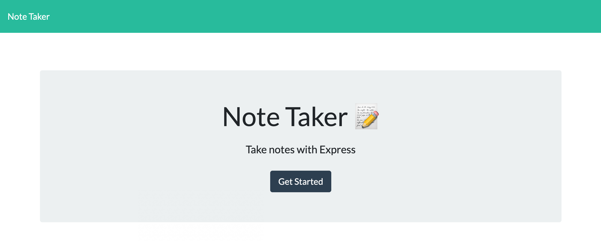
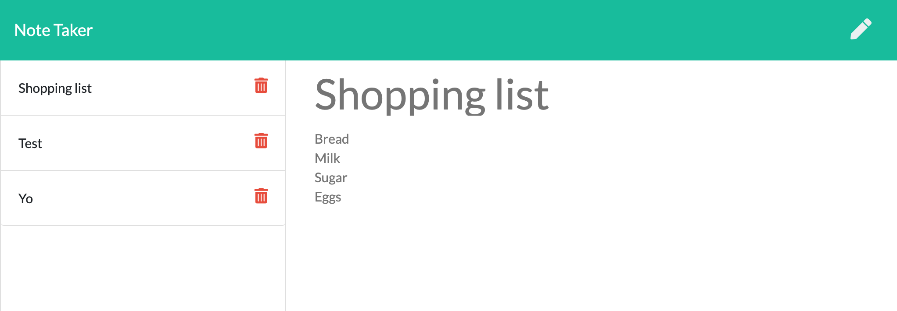
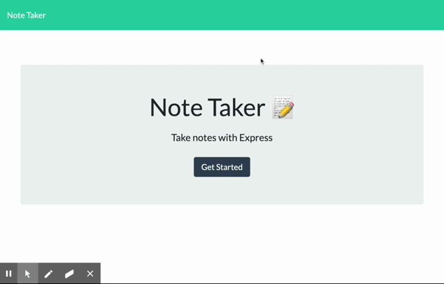

# [Noted!](https://pure-woodland-39519.herokuapp.com/)

[A note taking app,](https://pure-woodland-39519.herokuapp.com/) powered by Express.js.

## Table of Contents

- [Usage](#usage)
- [Contributing](#contributing)
- [Questions](#questions)
- [Credits](#credits)
- [License](#license)

## Usage

Navigate to <https://pure-woodland-39519.herokuapp.com/> to access the app.

**To start taking notes**: click the `Get Started` button. This will navigate to the [notes](https://pure-woodland-39519.herokuapp.com/notes) page.

**To create a new note**: from the notes page, click the pencil button.

When you are done with your note, click the save button to save your note. It will then appear on the left side of the page with the other saved notes.

Your notes are listed on the left side of the page.

**To view one of these notes**: click on the note you wish to view.

[back to Table of Contents](#table-of-contents)

## Contributing

Your contribution is most welcome! Please refer to the contributing guidelines when making contributions to this project.

Please note that this project is released with a [Contributor Code of Conduct](code_of_conduct.md). By participating in this project, you agree to abide by its terms.

[back to Table of Contents](#table-of-contents)

## Questions

Please direct any and all questions to [thadkingcole](https://github.com/thadkingcole) or via email at [thadjcole@gmail.com](mailto:thadjcole@gmail.com).

[back to Table of Contents](#table-of-contents)

## Credits

I would like to thank the following people/projects/guides:

- Express.js

[back to Table of Contents](#table-of-contents)

## License

[MIT](LICENSE) copyright (c) 2020 [Thaddeus Cole](mailto:thadjcole@gmail.com).

[back to Table of Contents](#table-of-contents)
